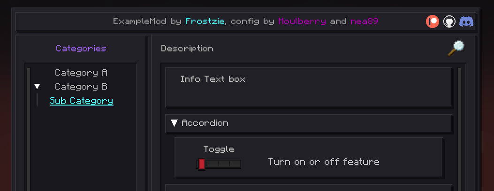

# Fabric Example Mod

This template is an example 1.21.4 fabric mod written in kotlin with the intent to show how to work with [MoulConfig](https://github.com/NotEnoughUpdates/MoulConfig) and other tools.
This template has every MoulConfig option showoff as well as saving config data. For 1.8.9 templates use [SkyHanni template](https://github.com/hannibal002/Example-1.8.9-Mod) or [nea's template](https://github.com/romangraef/Forge1.8.9Template/tree/kotlin).

To get started, clone this repository. In `gradle.properties`, replace the values of `archives_base_name` and `maven_group` with your own names. In `settings.gradle.kts` change `rootProject.name` to your desired mod id.

The `com.example` package needs to be renamed to match the value of `baseGroup`.

If you don't want mixins (which allow for modifying vanilla code), then you can remove the references to mixins from the `fabric.mod.json` and the `com.example.mixin` package.

Please note that Mixins should be kept in their own package, and should exclusively be written in Java, since older versions of Mixin don't play well with Kotlin.

To run the mod you will need Java 21 jdk. You can download those from [here](https://adoptium.net/temurin/releases/) (or use your own downloads).

When you import your project into IntelliJ, you need to set the gradle jvm to the Java 21 JDK in the gradle tab, and the Project SDK also to the Java 21 JDK. Then click on the sync button in IntelliJ, and it should create a run task called `Minecraft Client`. If it doesn't then try relaunching your IntelliJ. Warning for Mac users: You might have to remove the `-XStartOnFirstThread` vm argument from your run configuration. In the future, that should be handled by the plugin, but for now you'll probably have to do that manually.

To export your project, run the `gradle build` task, and give other people the file `build/libs/<modid>-<version>.jar`.